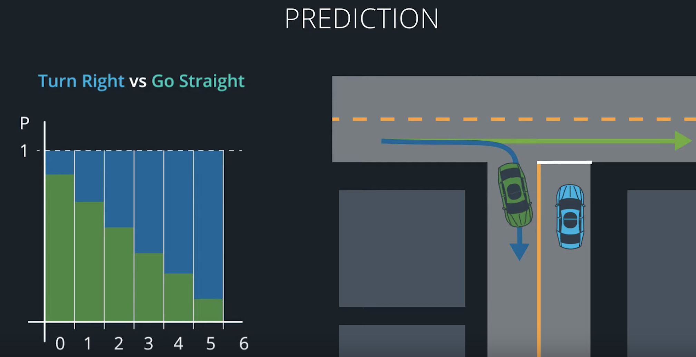
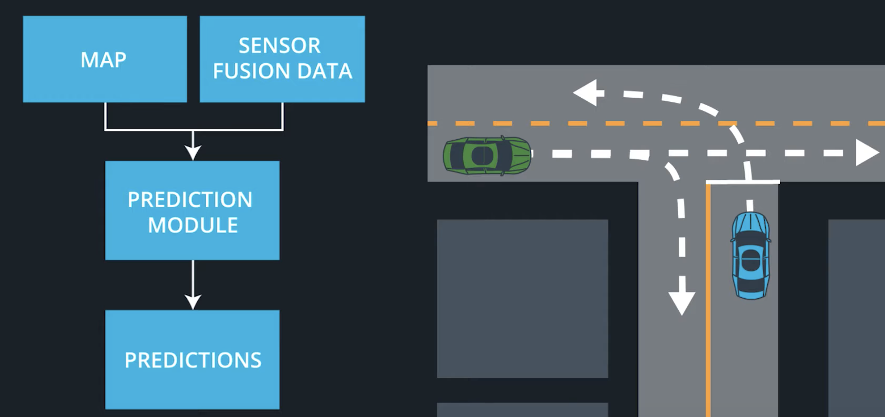
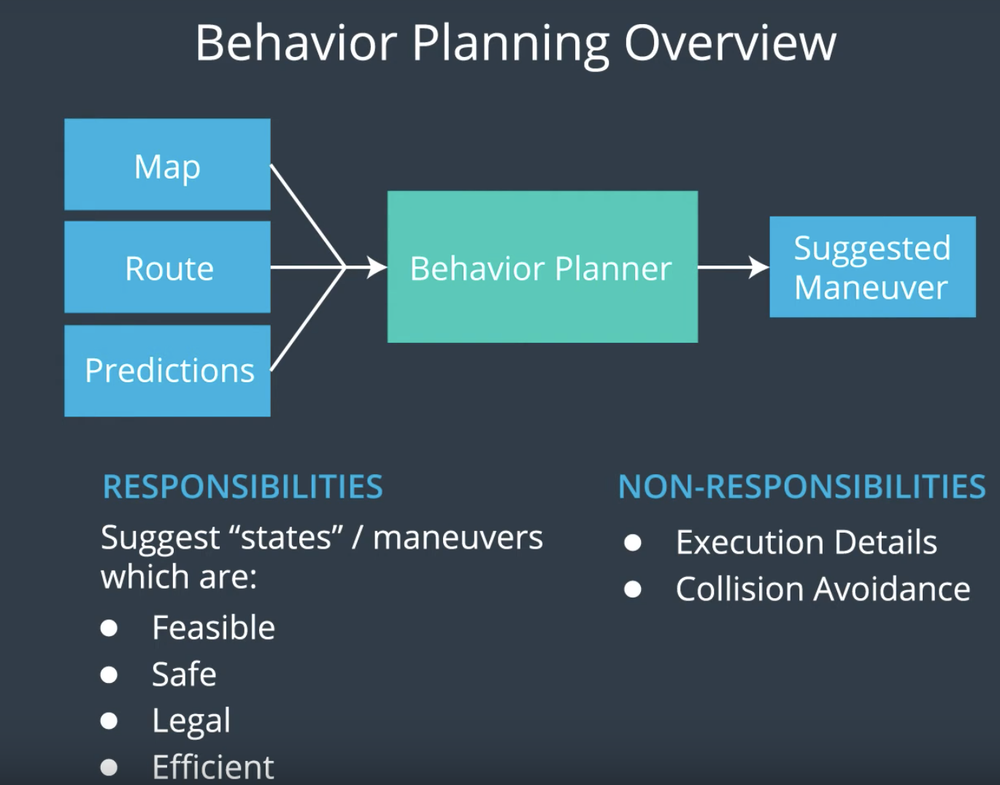
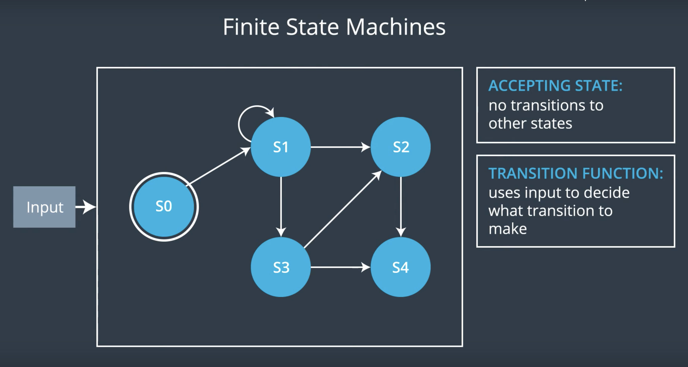

# CarND-Path-Planning-Project
Self-Driving Car Engineer Nanodegree Program
[](http://www.udacity.com/drive)

<figure>
 
 <figcaption>
 <p></p> 
 <p style="text-align: center;"> Fig: Autonomous Drive in the Simulator</p> 
 </figcaption>
</figure>
 <p></p>

## Conclusion
In the following you will find the development of an **intelligent high way pilot**.
That performs optimized lane changing, means the car only changes into a lane that improves its forward progress.

 *In the following are some highlights of the project described. For deeper, wider more detailed insights feel free to check the code that speaks for itself*.

Overview
---
1. Intro Behaviour Planner
2. Prediction 
3. Behavior Planer
4. Trajectoryplaner
5. Additional Information from Udacity


## Intro Behaviour Planer
One of the most challening topics for the self driving cars. The heard of it is a finite State Machine that govern the complexity of the driving care. Here its not about what exact input for the steering angle we are given its more about
on the macrscopiclevel whether its a left or right or change lanes of a highway or take a exit.

*Personal Note, after you understand a "Behaviour Planer" you will never look at you owen drive skill the same level as before*

The figure below shows the full interactions of a Behovoir Planer. With the control flows and the update times. The green box markes the area the is commonly knowns as Path-Planner. To enable me to focus just on this topic, all the other functions outside the box are provided by Udacity and 
briefly descibed in chapter 5.

<figure>
 
 <figcaption>
 <p></p> 
 <p style="text-align: center;"> Fig. 1: Behavior Planer: Schematic description of the control flows and timing. </p> 
 </figcaption>
</figure>
 <p></p>

## 2) Prediction
What makes pedictions interesting but also but also challening is its inherntly multi-modal. Means for example where will be a non ego car in the next 5ms (Figure 2 first image).

Prediction is done in general ether model based or data driven based. Latley also Hybride approaches occured. Model based approaches uses mathematicle models to predict the trajectories. 
Data driven approaches relie on maschine learning an examples to learn from. 

<figure>
 
 
 <figcaption>
 <p></p> 
 <p style="text-align: center;"> Fig. 2: Predication: Up inherntly multi-modal prediction. Down predication flow. </p> 
 </figcaption>
</figure>
 <p></p>

The upper figure the second image shows the control flow of a general prediaction function. Also our prediction function **generate_predictions** in `Car.cpp` file gets the same inputs. 
Anyhow for the beginning a very simple model base approach is used to predict the non-ego vehicle position, velcoity and lane at the time the ego vehicle finished the quing waypoint and can execute the 
new waypoints. With a low effort we got so a quite robost predication for most usecases of our highway pilot. Left out are predication of other cars lane changes.
To imporve this, in the further a Hybrid Naive-Bayes approach could be used. 
### Velocity calculation 
in line 403:

* vx: Non ego cars velocity [m/s] in gobal maps x direction.
* vy: Non ego cars velocity [m/s] in gobal maps y direction.

```c
double check_speed = sqrt(vx * vx + vy * vy);
```
### Postion predication 
in line 407:
 
* prev_size:  represents the waypoint for the ego vehicle that are queing. 
* 0.2:  5Hz is the run time of the programm. 

```c
 check_car_s += ((double)prev_size * .02 * check_speed);
```
### Lane Predication:
The lane predication, is actually a calculation of the current lane. This is done by taking the `d` distance from the non-ego vehicle to the highway center
into account. And substracting out of this the lane wides of 4m. In addition we assuming all cars are driving in the center of the lane (lane/2 = 2m). *So one example would be then 
that if the d = 6m. The car have to be in the middle lane. Lane wide 4m + 2m center lane = 6m.* 

line `393`:
```c
float d = sensor_fusion[i][6]; 
vector<int> predicted_lane{0,1,2};s
if (d < (2 + 4 * predicted_lane[j] + 2) && d > (2 + 4 * predicted_lane[j] - 2))
```

## 3) Behavior Planer / Costfunctions 
A great analagie of the Behaviour Planer is that it takes the respoibilies like a navigator on the pessanger seat. Its gives the commands where to go and when to change lanes.
However the nvaigator is not resposible for the safey and execution.<br/>
So two big parts are considert here, one is a **State Machine** that tells wichs maneuvers we should take and **Costfunctions** that weighign the possible maneuvers about the requirements
of the behaviour planning.


<figure>
 
 <figcaption>
 <p></p> 
 <p style="text-align: center;"> Fig. 3.1: Behavior Planning Overview. </p> 
 </figcaption>
</figure>
 <p></p>

### 3.1 Finite State Machine
A Finite State Machine (*FSM*) is a way to solve the Behaviour Planning Problem. It makes descions on a finte set of
discret states. In our project we have five states:

* KL: Keep Lane
* PLCL: Prepare Lane Change Left
* LCL: Lane Change Left
* PLCR: Prepare Lane Change Right
* LCR: Lane Change Right

Any pair can be conected by one or more transistions. So from the *KL* its possible to transtion to *PLCL/PCLR* and from there to *Lane Change*
or back to *KP* if transistion is not possible due to a vehicle at the other lane. The *LCL/LCR* states only transition back to *KP*.
The vector of possible trajectories is handelt by the function `successor_states` in the `Car.cpp` file and is the input for the *FSM*.
Seen in the example if a *FSM* in the image below.<br/>
The trasistion between the states is handled by a transions function, called **Chose next state**. Wich takes the input and calculates with the costfunctions the 
best next state. 
<figure>
 
 <figcaption>
 <p></p> 
 <p style="text-align: center;"> Fig. 3.2: Example Finite State Overview. </p> 
 </figcaption>
</figure>
 <p></p>


In our project we have five discret states:

* KL: Keep Lane
* PLCL: Prepare Lane Change Left
* LCL: Lane Change Left
* PLCR: Prepare Lane Change Right
* LCR: Lane Change Right


 Any pair can be conected by one or more transistions.

One way to implement a transition function is by generating rough trajectories for each accessible "next state" 
and then finding the best. To "find the best" we generally use cost functions. We can then figure out how costly each rough trajectory is
and then select the state with the lowest cost trajectory

-> Choose Next State. 
    -> Pseudo Code from Udacity

Transisions Decribed by sucessor States.

-> Than also a smooth tansistion into Cost functions!!

The hearth of the `Behaviour` function are the costfunctions, which are calculating the best behaviour for the current vehicle state. 
The chellange in gernal for cost functions are to define the right amout of functions and adjust them so that the desired behaviour is reached. 
For this project following four are implemented:

### 3.2 Costfunctions
Desiging costfunctions is difficult and to bring the to cooperate o produce resonable vehicle behavior is hard. Some of the challanges are to solve problems.
In general there are there posibilieties. Modifing the exciting constfunctions, adding new functions or tweaking the weights. A help here could be regrassion testing. This is part of develpoing safety critical software.
The costfunctions are desinged in that waht that output varietas between -1 - 1. And the twaeking is then done by weights is balance the costs. 

#### inefficenty_cost
The single most imported cost function. 
Cost becomes higher for trajectories with intened lane and final lane, that have traffic slower than traget speed.

*proposed_speed_intended* = Intended line speed
*proposed_speed_final*    = Last line speed 
*car.target_speed*        = Target Speed. In our case 49.5mph

in `Cost.cpp`line `81`.
 ```c
float cost = (2.0 * car.target_speed - proposed_speed_intended - proposed_speed_final) / car.target_speed;
```
#### distance to goal
The cost increases with both the distance of intended lane from the goal and the distance of the final lane from the goal. The cost of being out 
of the goal lane also becomes larger as the vehicle approaches the goal. This ensures that the vehicle is in the right lane by reaching the goal.


* Intended lane: the intended lane for the given behavior. For PLCR, PLCL, LCR, and LCL, this would be the one lane over from the current lane.
* Final lane: the immediate resulting lane of the given behavior. For LCR and LCL, this would be one lane over.
* Δs distance to the goal.
* The goal lane.


in `Cost.cpp`line `42 & 46`.
 ```c
int delta_d = 2.0 * car.goal_lane - data["intended_lane"] - data["final_lane"];
cost = 1 - 2 * exp(-(abs(delta_d) / distance));
```
#### offroad_cost
During the devlopment stage, the ego car left the desired path to dirve off road. Since there is never traffic jam. To penalize this behavoir 
all paths that will leave the road will get and enormous cost.

* lane_max: Are the lanes that allowed to drive

in `Cost.cpp`line `111`.
```c
  if ((data["intended_lane"] <= car.lane_max) && (data["intended_lane"] >= car.lane_min)) 
    {
      cost = 0;
    }
  else 
  {
    cost = 1;
  }
```
#### change_lange_cost
An other problem during the development occurt. The ego vehicle changed wildly the lane, because other lanes hat a marginal velocity advantages. 
To avoid this behaviour and just change the lanes due to a greater velocity advantage this function got introduced. 

in `Cost.cpp`line `146`.
```c
  if ((data["intended_lane"] <= car.lane_max) && (data["intended_lane"] >= car.lane_min))
  {
    cost = 0;
  }
  else
  {
    cost = 1;
  }
```
#### Velocity control
To control the velocity and max. acceleration of the vehicle a pritty nice and simple calculatio is used. 
On the first step the new max velocity is set to ensure an cofortable aceleration and decelreation smaller `10m/s^2`.
```c
double max_velocity_accel_limit = this->max_acceleration + this->v;
```

```c
double max_velocity_in_front = (vehicle_ahead.s - this->s - this->preferred_buffer) + vehicle_ahead.v - 0.5 * (this->a);
```
```c
new_velocity = std::min(std::min(max_velocity_in_front,
                                 max_velocity_accel_limit),
                                       this->target_speed);
```

## 3) Trajectoryplaner

A really helpful resource for doing this project and creating smooth trajectories is
http://kluge.in-chemnitz.de/opensource/spline/, the spline function is in a single hearder file is really easy to use.
The spline creates a smooth trajectory through given waypoints.  Three waypoints with a distance of `40m` are choosen. This have  profen given the best results between 
smoothnes and accourancy. Lower distances can lead to a too high lateral accerleration, by changing two hihgway lines. And a higher distance leads to an unconsitance path that cant hold the line.
The car.lane represents the desired lane by the behaviour planer.

in `main.cpp`line `182`.
```c
vector<double> next_wp0 = getXY(car.s + 40, (2 + 4 * car.lane), map_waypoints_s, map_waypoints_x, map_waypoints_y);
vector<double> next_wp1 = getXY(car.s + 80, (2 + 4 * car.lane), map_waypoints_s, map_waypoints_x, map_waypoints_y);
vector<double> next_wp2 = getXY(car.s + 120, (2 + 4 * car.lane), map_waypoints_s, map_waypoints_x, map_waypoints_y);
```

### Simulator.
You can download the Term3 Simulator which contains the Path Planning Project from the [releases tab (https://github.com/udacity/self-driving-car-sim/releases/tag/T3_v1.2).  

To run the simulator on Mac/Linux, first make the binary file executable with the following command:
```shell
sudo chmod u+x {simulator_file_name}
```

### Goals
In this project your goal is to safely navigate around a virtual highway with other traffic that is driving +-10 MPH of the 50 MPH speed limit. You will be provided the car's localization and sensor fusion data, there is also a sparse map list of waypoints around the highway. The car should try to go as close as possible to the 50 MPH speed limit, which means passing slower traffic when possible, note that other cars will try to change lanes too. The car should avoid hitting other cars at all cost as well as driving inside of the marked road lanes at all times, unless going from one lane to another. The car should be able to make one complete loop around the 6946m highway. Since the car is trying to go 50 MPH, it should take a little over 5 minutes to complete 1 loop. Also the car should not experience total acceleration over 10 m/s^2 and jerk that is greater than 10 m/s^3.

#### The map of the highway is in data/highway_map.txt
Each waypoint in the list contains  [x,y,s,dx,dy] values. x and y are the waypoint's map coordinate position, the s value is the distance along the road to get to that waypoint in meters, the dx and dy values define the unit normal vector pointing outward of the highway loop.

The highway's waypoints loop around so the frenet s value, distance along the road, goes from 0 to 6945.554.

## Basic Build Instructions

1. Clone this repo.
2. Make a build directory: `mkdir build && cd build`
3. Compile: `cmake .. && make`
4. Run it: `./path_planning`.

Here is the data provided from the Simulator to the C++ Program

#### Main car's localization Data (No Noise)

["x"] The car's x position in map coordinates

["y"] The car's y position in map coordinates

["s"] The car's s position in frenet coordinates

["d"] The car's d position in frenet coordinates

["yaw"] The car's yaw angle in the map

["speed"] The car's speed in MPH

#### Previous path data given to the Planner

//Note: Return the previous list but with processed points removed, can be a nice tool to show how far along
the path has processed since last time. 

["previous_path_x"] The previous list of x points previously given to the simulator

["previous_path_y"] The previous list of y points previously given to the simulator

#### Previous path's end s and d values 

["end_path_s"] The previous list's last point's frenet s value

["end_path_d"] The previous list's last point's frenet d value

#### Sensor Fusion Data, a list of all other car's attributes on the same side of the road. (No Noise)

["sensor_fusion"] A 2d vector of cars and then that car's [car's unique ID, car's x position in map coordinates, car's y position in map coordinates, car's x velocity in m/s, car's y velocity in m/s, car's s position in frenet coordinates, car's d position in frenet coordinates. 

## Details

1. The car uses a perfect controller and will visit every (x,y) point it recieves in the list every .02 seconds. The units for the (x,y) points are in meters and the spacing of the points determines the speed of the car. The vector going from a point to the next point in the list dictates the angle of the car. Acceleration both in the tangential and normal directions is measured along with the jerk, the rate of change of total Acceleration. The (x,y) point paths that the planner recieves should not have a total acceleration that goes over 10 m/s^2, also the jerk should not go over 50 m/s^3. (NOTE: As this is BETA, these requirements might change. Also currently jerk is over a .02 second interval, it would probably be better to average total acceleration over 1 second and measure jerk from that.

2. There will be some latency between the simulator running and the path planner returning a path, with optimized code usually its not very long maybe just 1-3 time steps. During this delay the simulator will continue using points that it was last given, because of this its a good idea to store the last points you have used so you can have a smooth transition. previous_path_x, and previous_path_y can be helpful for this transition since they show the last points given to the simulator controller with the processed points already removed. You would either return a path that extends this previous path or make sure to create a new path that has a smooth transition with this last path.

## Dicussion:
Prediction replaced by a hybride approach modle based and data driven.
Trajectorirs replaced by JMT -> Paper


## Tips

A really helpful resource for doing this project and creating smooth trajectories was using http://kluge.in-chemnitz.de/opensource/spline/, the spline function is in a single hearder file is really easy to use.

---

## Dependencies

* cmake >= 3.5
  * All OSes: [click here for installation instructions](https://cmake.org/install/)
* make >= 4.1
  * Linux: make is installed by default on most Linux distros
  * Mac: [install Xcode command line tools to get make](https://developer.apple.com/xcode/features/)
  * Windows: [Click here for installation instructions](http://gnuwin32.sourceforge.net/packages/make.htm)
* gcc/g++ >= 5.4
  * Linux: gcc / g++ is installed by default on most Linux distros
  * Mac: same deal as make - [install Xcode command line tools]((https://developer.apple.com/xcode/features/)
  * Windows: recommend using [MinGW](http://www.mingw.org/)
* [uWebSockets](https://github.com/uWebSockets/uWebSockets)
  * Run either `install-mac.sh` or `install-ubuntu.sh`.
  * If you install from source, checkout to commit `e94b6e1`, i.e.
    ```
    git clone https://github.com/uWebSockets/uWebSockets 
    cd uWebSockets
    git checkout e94b6e1
    ```

## Editor Settings

We've purposefully kept editor configuration files out of this repo in order to
keep it as simple and environment agnostic as possible. However, we recommend
using the following settings:

* indent using spaces
* set tab width to 2 spaces (keeps the matrices in source code aligned)

## Code Style

Please (do your best to) stick to [Google's C++ style guide](https://google.github.io/styleguide/cppguide.html).

## Project Instructions and Rubric

Note: regardless of the changes you make, your project must be buildable using
cmake and make!


## Call for IDE Profiles Pull Requests

Help your fellow students!

We decided to create Makefiles with cmake to keep this project as platform
agnostic as possible. Similarly, we omitted IDE profiles in order to ensure
that students don't feel pressured to use one IDE or another.

However! I'd love to help people get up and running with their IDEs of choice.
If you've created a profile for an IDE that you think other students would
appreciate, we'd love to have you add the requisite profile files and
instructions to ide_profiles/. For example if you wanted to add a VS Code
profile, you'd add:

* /ide_profiles/vscode/.vscode
* /ide_profiles/vscode/README.md

The README should explain what the profile does, how to take advantage of it,
and how to install it.

Frankly, I've never been involved in a project with multiple IDE profiles
before. I believe the best way to handle this would be to keep them out of the
repo root to avoid clutter. My expectation is that most profiles will include
instructions to copy files to a new location to get picked up by the IDE, but
that's just a guess.

One last note here: regardless of the IDE used, every submitted project must
still be compilable with cmake and make./

## How to write a README
A well written README file can enhance your project and portfolio.  Develop your abilities to create professional README files by completing [this free course](https://www.udacity.com/course/writing-readmes--ud777).

