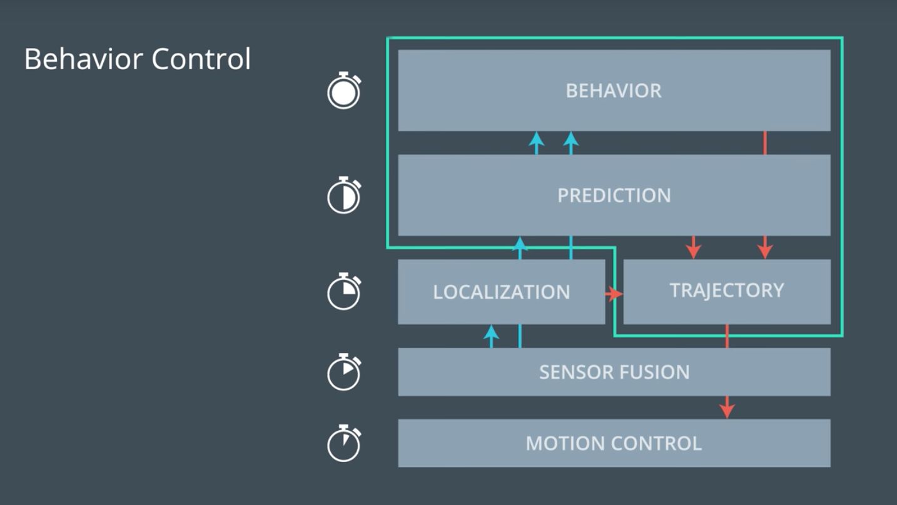
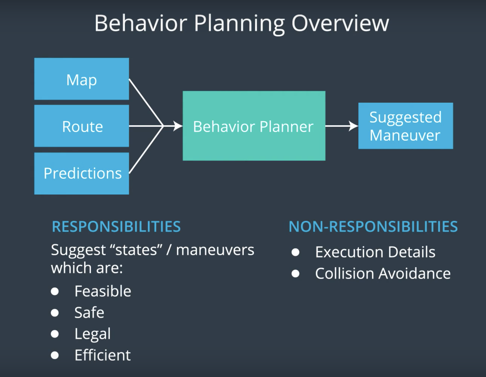

# CarND-Path-Planning-Project
Self-Driving Car Engineer Nanodegree Program
[](http://www.udacity.com/drive)

<figure>
 
 <figcaption>
 <p></p> 
 <p style="text-align: center;"> Fig: Autonomous Drive in the Simulator</p> 
 </figcaption>
</figure>
 <p></p>

## Conclusion
In the following you will find the development of an **intelligent high way pilot**.
That performs optimized lane changing, means the car only changes into a lane that improves its forward progress.

 *In the following are some highlights of the project described. For deeper, wider more detailed insights feel free to check the code that speaks for itself*.

Overview
---
1. Intro Behavior Planner
2. Prediction 
3. Behavior Planner
4. Trajectory Planner
5. Appendix: *Build Instructions & Simulator* ...

## Intro Behavior Planner
In self-driving  cars behavior selection, is on of the most challenging topics.
Simplified, the topic is **what to do next**? And not on a minute level of what  exact control input to give a to steering wheel but more of a macroscopic level
whether it's a left or right or change lanes of a highway or take an exit.

*Personal Note, after you understand a "Behavior Planner" you will never look at you own drive skill the same level as before*

**What functionalities belog to a Behavior Planner and what is a Path Planner**? 
The figure below shows the full interactions of a Behavior Planner with all its belonging functionality, control flows and the update times. 
The green box marks the area that is commonly knowns as Path-Planner. This is the focus of this project. To enable me to focus on 
this, all the other functions outside the Path Planner are provided by Udacity and 
briefly described in the Appendix.

<figure>
 
 <figcaption>
 <p></p> 
 <p style="text-align: center;"> Fig. 1: Behavior Planner: Schematic description of the control flows and timing. </p> 
 </figcaption>
</figure>
 <p></p>

## 2) Prediction
What makes predictions interesting but also but also challenging is its inherently multi-multimodality. Means 
for example where will be a non ego car in the next 5ms (Figure 2 first image).
Prediction is done in general ether **model based** or **data driven** based. Lately also Hybride approaches occurred.
* Model based approaches uses mathematical models to predict the trajectories.
* Data driven approaches relay on machine learning an examples to learn from. 

<figure>
 
 
 <figcaption>
 <p></p> 
 <p style="text-align: center;"> Fig. 2: Prediction: Up inherntly multi-modal prediction. Down prediction flow. </p> 
 </figcaption>
</figure>
 <p></p>

The second image shows the control flow of a general prediction function. Also our function **generate_predictions** in `Car.cpp` file gets the same inputs. 
Anyhow for the beginning a very simple model base approach is used to predict the non-ego vehicle position, velocity and lane at the time the ego vehicle can execute the 
new waypoints. With a low effort we got so a quite robust prediction for most use-cases of our highway pilot.

### Velocity Calculation 
in line 403:

* vx: Non ego cars velocity [m/s] in global maps x direction.
* vy: Non ego cars velocity [m/s] in global maps y direction.

```c
double check_speed = sqrt(vx * vx + vy * vy);
```
### Position Prediction 
in line 407:
 
* prev_size:  represents the waypoint for the ego vehicle that are queuing. 
* 0.2:  5Hz is the run time of the program. 

```c
 check_car_s += ((double)prev_size * .02 * check_speed);
```
### Lane Prediction:
The lane prediction, is actually a calculation of the current lane. This is done by taking the `d` distance from the non-ego vehicle to the highway center
into account. And subtracting out of this the lane wides of 4m. In addition we assuming all cars are driving in the center of the lane (lane/2 = 2m). *So one example would be then 
that if the d = 6m. The car have to be in the middle lane. Lane wide 4m + 2m center lane = 6m.* 

line `393`:
```c
float d = sensor_fusion[i][6]; 
vector<int> predicted_lane{0,1,2};
if (d < (2 + 4 * predicted_lane[j] + 2) && d > (2 + 4 * predicted_lane[j] - 2))
```
**Left out** of the current prediction are other cars lane changes.
To improve this in the further a Hybrid Naive-Bayes approach could be used, so that we could also predict when a non-ego car 
will change lanes so that our Planner would be more robust


## 3) Behavior Planner / Cost Functions 
A great analogy for the Behavior Planner is that it inherent the responsibility of a navigator on the passenger seat. 
It gives the commands where to go and when to change lanes.
However the navigator is not responsible for the safety and maneuver execution.<br/>
To bring the Planner alive, two big parts are needed: One is a **State Machine** that govern the complex behavior of the self driving car
and the other one are **Cost Functions** that tells which is the best possible next behavior.

<figure>
 
 <figcaption>
 <p></p> 
 <p style="text-align: center;"> Fig. 3.1: Behavior Planning Overview. </p> 
 </figcaption>
</figure>
 <p></p>

### 3.1 Finite State Machine
A Finite State Machine (*FSM*) is a way to solve the [Behavior Planning Problem](https://www.cs.cmu.edu/afs/cs/project/jair/pub/volume9/mazer98a-html/node2.html).
It gets as input several possible next trajectories and based on a transition function it makes decisions on a finite set of
discrete states. In the image below is an overview of the schematic work of a *FSM*.

<figure>
 
 <figcaption>
 <p></p> 
 <p style="text-align: center;"> Fig. 3.2: Example, Finite State Overview. </p> 
 </figcaption>
</figure>
 <p></p>


 In our project we have five states:

* **KL**: Keep Lane
* **PLCL**: Prepare Lane Change Left
* **LCL**: Lane Change Left
* **PLCR**: Prepare Lane Change Right
* **LCR**: Lane Change Right

Any pair can be connected by one or more transitions. So from the *KL* its possible to transition to *PLCL/PCLR* and from there to *Lane Change*
or back to *KL*, if transition is not possible due to a vehicle at the other lane. The *LCL/LCR* states can only transition back to *KL*.
In figure 3.3 you can see the project specific *FSM* behavior.

The function `successor_states` line `92` in the `Car.cpp` file, creates the input as possible next trajectories for the *FSM*
and the transition function **Chose next state** in line `43` handles the shifts between the states by calculating the best
next state with the cost functions.

<figure>
 
 <figcaption>
 <p></p> 
 <p style="text-align: center;"> Fig. 3.3: Finite State Machine of this Project. </p> 
 </figcaption>
</figure>
 <p></p>

For a better readability the code is **not** described here in detail! However feel free to look into the code, comments are made there 
to increase the understanding. 

### 3.2 Cost Functions
Designing cost functions is difficult and to bring them to cooperate and to produce a reasonable vehicle behavior is hard.
Some of the challenges are to solve problems, without unsolving old ones.

In general there are three possibilities to handle and solve cost function problems:
* Modifying the exciting cost functions
* Adding new cost functions
* Tweaking the weights. 

Cost functions by it self are designed to variety the output between 1 and -1 so that the tuning can be done
by multiplying these outputs with weights. A desired behavior is reached with following weights:
Line `17` in the `Cost.cpp` file.
```c
const float REACH_GOAL = pow(10, 1);
const float EFFICIENCY = pow(10, 4);
const float OFFROAD    = pow(10, 7);
const float LANECHANGE = pow(10, 2) * 3;
```

#### Inefficiency Cost (Target Efficiency)
The single most imported cost function for an optimized lane change behavior. It calculates the cost for the desired path
by taking the lane speed into account. So the cost becomes higher for trajectories that have a traffic slower than the traget speed.

* **proposed_speed_intended**: Intended line speed
* **proposed_speed_final**:    Last line speed 
* **car.target_speed**:        Target Speed. In our case 49.5mph

Line `81` in `Cost.cpp`file.
 ```c
float cost = (2.0 * car.target_speed - proposed_speed_intended - proposed_speed_final) / car.target_speed;
```

#### Distance to goal (Comfort/ Feasibility)
The cost increases with both the distance of intended lane from the goal and the distance of the final lane from the goal. The cost of being out 
of the goal lane also becomes larger as the vehicle approaches the goal. This ensures that the vehicle is in the right lane by reaching the goal.


* **Intended lane**: the intended lane for the given behavior. For *PLCR*, *PLCL*, *LCR*, and *LCL*, this would be the one lane over from the current lane.
* **Final lane**: the immediate resulting lane of the given behavior. For *LCR* and *LCL*, this would be one lane over.
* **Δs** distance to the goal.
* The **goal lane**.


Line `42 & 46` in `Cost.cpp`.
 ```c
int delta_d = 2.0 * car.goal_lane - data["intended_lane"] - data["final_lane"];
cost = 1 - 2 * exp(-(abs(delta_d) / distance));
```
#### Off Road Cost (Safety)
During the development stage, the ego car left the desired path to drive off road. Since there is never traffic jam and the ego
car can drive with max speed. To penalize this behavior 
all paths that are leaving the road are getting an enormous cost.

* **lane_max**: Are the lanes that allowed to drive.

in `Cost.cpp`line `111`.
```c
  if ((data["intended_lane"] <= car.lane_max) && (data["intended_lane"] >= car.lane_min)) 
    {
      cost = 0;
    }
  else 
  {
    cost = 1;
  }
```
#### Change Lange Cost (Comfort)
An other problem during the development occurred. Sometimes the ego vehicle toggled between the lanes, because other lanes had
a brief marginal velocity advantage. 
To sophisticated the lane change behavior on traffic jam situations so that the lane change just happen if a real advantage occur, this function got introduced. 

Line `146` in `Cost.cpp`.
```c
  if ((data["intended_lane"] <= car.lane_max) && (data["intended_lane"] >= car.lane_min))
  {
    cost = 0;
  }
  else
  {
    cost = 1;
  }
```

## 4) Trajectory Planner
A trajectory is not just a curve the car can follow, but also a time sequence in which we say how fast the car should go.
In finding trajectories are many imported things out to watch for. The most imported on is **"don`t crash"**.  But also passenger comfort, 
the lateral and longitudinal acceleration and jerk is imported. So the challenge here is to make it as smooth and elegant as possible.

The biggest challenge is to find a feasible path as sequence of movements in the configuration space. ( The space defines all the possible configurations, in 3D this is x,y, theta.)
That moves the car from the actual position, defined by localization and sensors to the end position, desired from the behavior planner
and considers all the comfort requirement. In the image below is the general [motion planning problem](https://en.wikipedia.org/wiki/Motion_planning).
described

<figure>
 
 <figcaption>
 <p></p> 
 <p style="text-align: center;"> Fig. 4.1: Motion Planning Problem. </p> 
 </figcaption>
</figure>
 <p></p>

To solve this problem there are many **motion planning algorithms**. In the figure below are the main algorithms described

* **Combinational Methods** are usually sliding the problem into small pieces and first solving the motion planning problem by connecting
this elements. But usually they do not scale well for large environments.

* **Potential Field Methods** are reacting methods. Each obstacle is creating an anti gravity field, which makes it harder for the vehicle 
to come close. A good idea is to use this on pedestrians and bikes to encourage you planning algorithm to find trajectories away from them.
The back side is, that they can push us into local minima and away from the best solution.

* **Optimal Control** consist trying to solve the motion planning problem and the controlling input generation in one algorithm.
However, it's hard to incorporate all of the constrains related to the other vehicles in a good enough way in order to work fast.

* **Sampling Based Methods** Are good to use for this problem, hence they require somewhat easier to compute definition of the free 
space. They use a collision detection module that probes if the free space to see if a configuration is in collision or not. Also not 
all part of the free space have to be explored to find a solution. Examples here are the A*-Algorithm or Hybrid A*.


<figure>
 
 <figcaption>
 <p></p> 
 <p style="text-align: center;"> Fig. 4.2: Motion Planning Algorithms. </p> 
 </figcaption>
</figure>
 <p></p>

-> In a more structured environment like the highway situation we can also take algorithms that have less computational effort.
Like the [Polynomial Trajectory Generation](https://www.researchgate.net/profile/Moritz-Werling/publication/224156269_Optimal_Trajectory_Generation_for_Dynamic_Street_Scenarios_in_a_Frenet_Frame/links/54f749df0cf210398e9277af/Optimal-Trajectory-Generation-for-Dynamic-Street-Scenarios-in-a-Frenet-Frame.pdf)
algorithm, or in this project the divide and rule principle is used. So that the problem is splitter into two main problems. The comfort part:
velocity, acceleration, jerk and crash control and into trajectory creation and lateral control.

#### 4.1 Velocity, Acceleration (+/-), Jerk and Crash Control
The following slices of code are necessary for a traffic adapted trajectory generation. Before choosing the best next state with the cost function, 
the possible next states condition gets validated. 
So in the function `get kinematics` file `Car.cpp` depending on the current conditions and the non-ego vehicle conditions the further traffic adapted trajectory states are set.

##### Velocity and distance control
To control the velocity and max. acceleration of the vehicle some pretty nice and simple calculations are used in the following. 
On the first step the new max velocity is set to ensure a comfortable max. acceleration and deceleration. The variable `max_acceleration` with a actual value 0f 0.224
ensures a change rate of max. `10m/s^2`.
Line `162s`.
```c
double max_velocity_accel_limit = this->max_acceleration + this->v;
```
The next line is pretty nice. The velocity is calculated based on the distance of the front car. So we can ensure 
that both conditions, velocity and distance are adapted for the ego car. So for example if the distance to the car in front is high, 
the velocity of the ego car will be higher than the front cars velocity.
And transition linear with a decreasing distance until a certain minimum distance is reached and our car is adapting 1:1 the velocity of the front car. 
Line `196`.
```c
double max_velocity_in_front = (vehicle_ahead.s - this->s - this->preferred_buffer) + vehicle_ahead.v - 0.5 * (this->a);
```
And to ensure that none of this values exits the boundaries this line of code is introduced in line `200`.
```c
new_velocity = std::min(std::min(max_velocity_in_front,
                                 max_velocity_accel_limit),
                                       this->target_speed);
```
##### Crash control at lane change
**Before** executing Lane Changes the following check is done in line `309`. And if a car is detected in the area of lane change, 
the execution is denied.
```c
if (((next_lane_vehicle.s > (this->s - 10)) && ((next_lane_vehicle.s - this->s) < 20)) && next_lane_vehicle.lane == new_lane)
```
#### 4.2 Trajectory generation
To create a smooth trajectory a spline function is used. A really helpful resource for doing this is
http://kluge.in-chemnitz.de/opensource/spline/, the spline function is in a single header file is really easy to use.
The spline creates a smooth trajectory through given waypoints.  Three waypoints with a distance of `40m` are chosen. This have proven given the best results between 
smoothness and accuracy. Lower distances can lead to a too high lateral acceleration, when changing two highway lines. And a higher distance leads to an inconsistence path that cant hold the line.
  The car.lane represents the desired lane by the behavior planer.

in `main.cpp`line `182`.
```c
vector<double> next_wp0 = getXY(car.s + 40, (2 + 4 * car.lane), map_waypoints_s, map_waypoints_x, map_waypoints_y);
vector<double> next_wp1 = getXY(car.s + 80, (2 + 4 * car.lane), map_waypoints_s, map_waypoints_x, map_waypoints_y);
vector<double> next_wp2 = getXY(car.s + 120, (2 + 4 * car.lane), map_waypoints_s, map_waypoints_x, map_waypoints_y);
```

## 5) Build Instructions & Simulator & Additional Information from Udacity

## Basic Build Instructions

1. Clone this repo.
2. Make a build directory: `mkdir build && cd build `
3. Compile: `cmake -DCMAKE_BUILD_TYPE=RelWithDebInfo .. && make`
4. Run it: `./path_planning`.

### Simulator.
You can download the Term3 Simulator which contains the Path Planning Project from the [releases tab (https://github.com/udacity/self-driving-car-sim/releases/tag/T3_v1.2).  

To run the simulator on Mac/Linux, first make the binary file executable with the following command:
```shell
sudo chmod u+x {simulator_file_name}
```

## Dependencies

* cmake >= 3.5
  * All OSes: [click here for installation instructions](https://cmake.org/install/)
* make >= 4.1
  * Linux: make is installed by default on most Linux distros
  * Mac: [install Xcode command line tools to get make](https://developer.apple.com/xcode/features/)
  * Windows: [Click here for installation instructions](http://gnuwin32.sourceforge.net/packages/make.htm)
* gcc/g++ >= 5.4
  * Linux: gcc / g++ is installed by default on most Linux distros
  * Mac: same deal as make - [install Xcode command line tools]((https://developer.apple.com/xcode/features/)
  * Windows: recommend using [MinGW](http://www.mingw.org/)
* [uWebSockets](https://github.com/uWebSockets/uWebSockets)
  * Run either `install-mac.sh` or `install-ubuntu.sh`.
  * If you install from source, checkout to commit `e94b6e1`, i.e.
    ```
    git clone https://github.com/uWebSockets/uWebSockets 
    cd uWebSockets
    git checkout e94b6e1
    ```

### Goals
In this project your goal is to safely navigate around a virtual highway with other traffic that is driving +-10 MPH of the 50 MPH speed limit. You will be provided the car's localization and sensor fusion data, there is also a sparse map list of waypoints around the highway. The car should try to go as close as possible to the 50 MPH speed limit, which means passing slower traffic when possible, note that other cars will try to change lanes too. The car should avoid hitting other cars at all cost as well as driving inside of the marked road lanes at all times, unless going from one lane to another. The car should be able to make one complete loop around the 6946m highway. Since the car is trying to go 50 MPH, it should take a little over 5 minutes to complete 1 loop. Also the car should not experience total acceleration over 10 m/s^2 and jerk that is greater than 10 m/s^3.

#### The map of the highway is in data/highway_map.txt
Each waypoint in the list contains  [x,y,s,dx,dy] values. x and y are the waypoint's map coordinate position, the s value is the distance along the road to get to that waypoint in meters, the dx and dy values define the unit normal vector pointing outward of the highway loop.

The highway's waypoints loop around so the frenet s value, distance along the road, goes from 0 to 6945.554.

#### Main car's localization Data (No Noise)

["x"] The car's x position in map coordinates

["y"] The car's y position in map coordinates

["s"] The car's s position in frenet coordinates

["d"] The car's d position in frenet coordinates

["yaw"] The car's yaw angle in the map

["speed"] The car's speed in MPH

#### Previous path data given to the Planner

//Note: Return the previous list but with processed points removed, can be a nice tool to show how far along
the path has processed since last time. 

["previous_path_x"] The previous list of x points previously given to the simulator

["previous_path_y"] The previous list of y points previously given to the simulator

#### Previous path's end s and d values 

["end_path_s"] The previous list's last point's frenet s value

["end_path_d"] The previous list's last point's frenet d value

#### Sensor Fusion Data, a list of all other car's attributes on the same side of the road. (No Noise)

["sensor_fusion"] A 2d vector of cars and then that car's [car's unique ID, car's x position in map coordinates, car's y position in map coordinates, car's x velocity in m/s, car's y velocity in m/s, car's s position in frenet coordinates, car's d position in frenet coordinates. 

## Details

1. The car uses a perfect controller and will visit every (x,y) point it recieves in the list every .02 seconds. The units for the (x,y) points are in meters and the spacing of the points determines the speed of the car. The vector going from a point to the next point in the list dictates the angle of the car. Acceleration both in the tangential and normal directions is measured along with the jerk, the rate of change of total Acceleration. The (x,y) point paths that the planner recieves should not have a total acceleration that goes over 10 m/s^2, also the jerk should not go over 50 m/s^3. (NOTE: As this is BETA, these requirements might change. Also currently jerk is over a .02 second interval, it would probably be better to average total acceleration over 1 second and measure jerk from that.

2. There will be some latency between the simulator running and the path planner returning a path, with optimized code usually its not very long maybe just 1-3 time steps. During this delay the simulator will continue using points that it was last given, because of this its a good idea to store the last points you have used so you can have a smooth transition. previous_path_x, and previous_path_y can be helpful for this transition since they show the last points given to the simulator controller with the processed points already removed. You would either return a path that extends this previous path or make sure to create a new path that has a smooth transition with this last path.

---

## Code Style

Please (do your best to) stick to [Google's C++ style guide](https://google.github.io/styleguide/cppguide.html).

## Additional Study Information
[Optimal Trajectory Generation for Dynamic Street Scenarios in a Fren ́et Frame](https://www.researchgate.net/profile/Moritz-Werling/publication/224156269_Optimal_Trajectory_Generation_for_Dynamic_Street_Scenarios_in_a_Frenet_Frame/links/54f749df0cf210398e9277af/Optimal-Trajectory-Generation-for-Dynamic-Street-Scenarios-in-a-Frenet-Frame.pdf)
[Path Planning Problem](https://www.cs.cmu.edu/afs/cs/project/jair/pub/volume9/mazer98a-html/node2.html)
[Difference Motion Planing and Path Planning](https://robotics.stackexchange.com/questions/8302/what-is-the-difference-between-path-planning-and-motion-planning)
[Lecture: Robot Motion Planning](http://ais.informatik.uni-freiburg.de/teaching/ss11/robotics/slides/18-robot-motion-planning.pdf)
[Lecture: Path Planning and Collision Avoidance](http://ais.informatik.uni-freiburg.de/teaching/ss10/robotics/slides/16-pathplanning.pdf)
[Survey of Motion Planning and Control Techniques](https://arxiv.org/pdf/1604.07446.pdf)